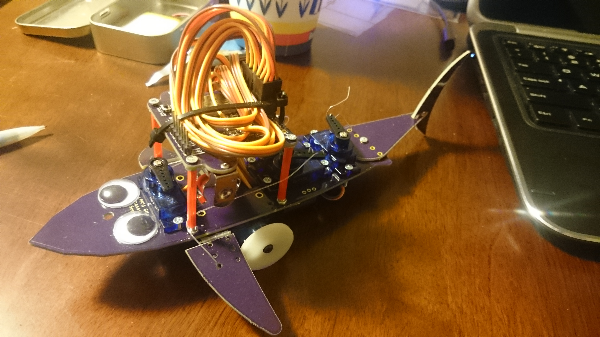

# LAN'd Shark Project
The LAN'd Shark is a small, wifi-connected shark robot with some wicked hair and underglow lights. This was built and designed by the Oshpark team for [PDX Mini-Maker Faire](https://www.omsi.edu/maker-faire-pdx) 2015. 

The shark communicates via an MQTT server, and has supplimental remote control boards that allow a direct interface. However, you could esily modify it for automated or automatic control. If you need a remote MQTT server, [data.sparkfun.com](https://data.sparkfun.com/) is simple and easy to use, or you can install your own with tools  such as [Mosquitto](http://mosquitto.org/).

## Project Status
### [BaseStation](basestation/)
The basestation is fully operational, and capable of reading up to 3 teensies, and transmitting data over a network to an MQTT server.

### [Controller](controller/)
The controller is fully operational in both hardware and code.

### [Shark Bot](sharkbot/)
The Shark Brains hardware is fully operational, and can drive several servo motors from an ESP2866. 

The chassis mechanics are still a bit undefined, and a bit erratic. However, the base board works great as a mounting platform for servo motors, and can be laser cut

The Arduino sketch is still in a bit of a mess, but can read incoming controller data and react. However, the Animation and ServoPlus libraries have some bugs and needs to be rewritten/updated in order for the shark to react correctly.

Here's a picture of the completed Sharkbot. 

# Required Utilities
## Software
[Arduino 1.65](https://www.arduino.cc/en/Main/Software) 

[TeensyDuino](https://www.pjrc.com/teensy/td_download.html) if using the controllers

[ESP2866 Arduino](https://github.com/esp8266/Arduino) For the Sharkbot and basestation boards

[Eagle CAD](http://www.cadsoftusa.com/download-eagle/) is needed to modify the PCB files or generate gerbers. The `.BRD` files can be directly to [OSHPark.com](http://oshpark.com) for purchase without Eagle.

## Arduino Libraries
[PubSub Client](https://github.com/Imroy/pubsubclient)

[Teensy 3.1 SPI Slave library](https://github.com/soerup/Teensy-3.0-SPI-Master---Slave) for the controller boards

[Adafruit Neopixel (Teensy version)](https://github.com/PaulStoffregen/Adafruit_NeoPixel)

# Liscence 
Released currently under the [MIT License](./LICENSE.txt)

